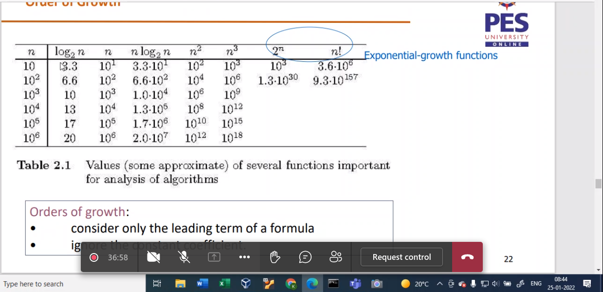
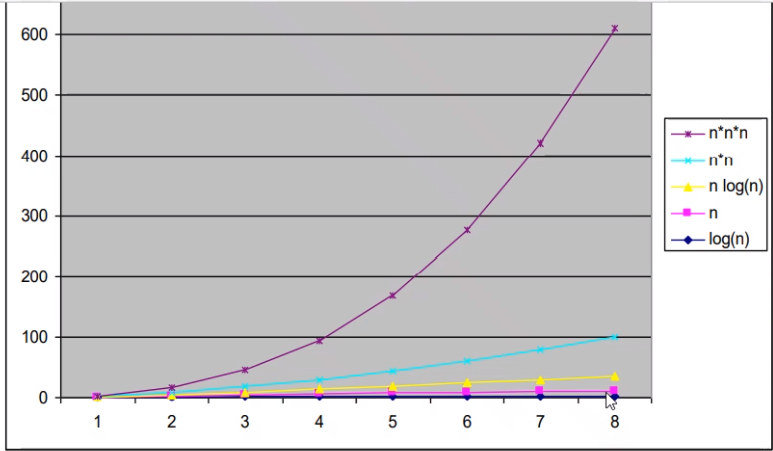
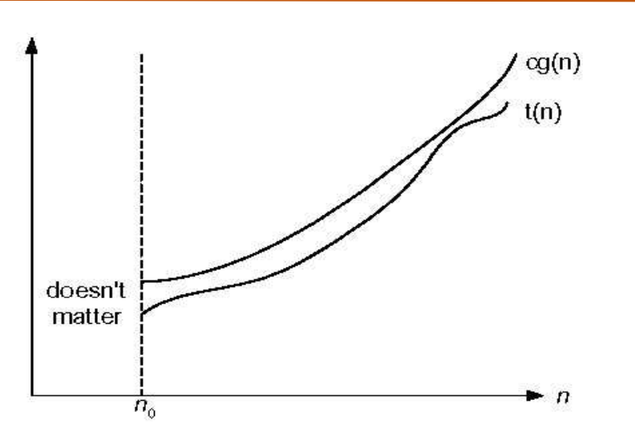
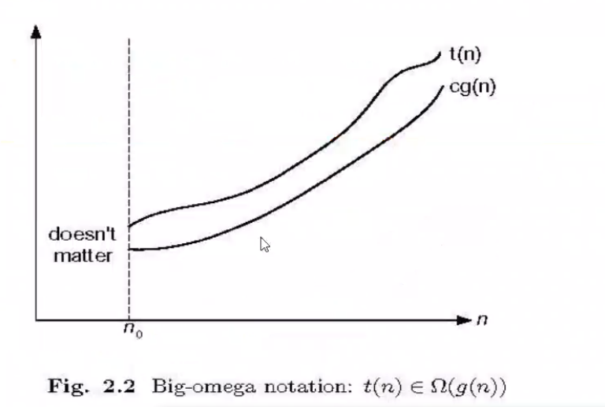
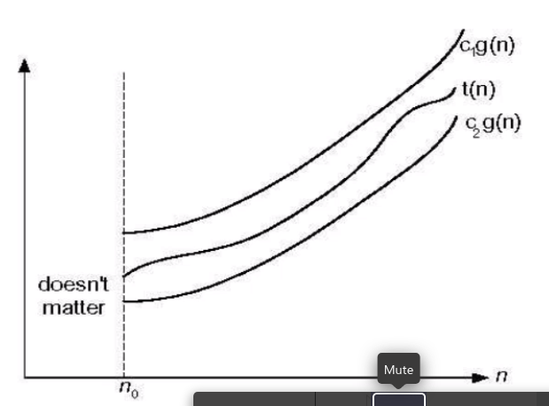

# Session-4


Tabualte the changing order

## Analysis Framework

```
for i in a to b [inclusive]
    iterations : b-a+1
```
i=a
while i<=b
    interation : b-a+1
    comparision : b-a+2 (for fail 1 more)


- Input size
```
    array : # of elems
    matrix : order
    string : # of cahrs
    int : # of bits
 ```

- basic operation
```
    innermost loop
    find the operation
```

for i <- 2 to n : Iterations : n-2+1 : n-1

    <some code ... less than n time>
    for i <- 2 to n                 :n
        do 
            f <- a+b....            :n-1
            prev <- ...             :n-1
            ...                     :n-1
the time for the above alogirthm is considered n

A formula for calculating time : 

T(n) ~ Cop.C(n)

## Order of growth : 

Say,

Algo1 : c1*n^2 + c2*n + c3

Algo2 : c1+n^3

To find which one grows fasteer we divide the two

if when diving two and and diving those with the highest power, see solved problems

if 0 numerator gorws faster 

if constatnt both are same

if INF then numerator grows faster





Solve these problems using "that many times".

Solve problems of text book, very important By Levitin.

Solved problems : 


## Efficiency : 

Best case : Cbest

Worst case : Cworst

Average case : Doing this is hard 
    for linear search : 
    Cavg = Sum(p(1,2,3,4,5,6,7,....n))/n

## Notations for efficiency : 

So a upper bound can be defined for a given fucntion or formula

say 10n^2+5n, we can definetly say it doesn't exceed n^3

so we can tell n^3 is a upper bound of first eqn

so lets generalize : say first was t(n) and cg(n) is the upper bound 

represented by : t(n) E O(cg(n))

So the value of c can be anything as long as there is a no above which cg(n) is upper bounding

the main fn t(n)

So in words, a function t(n) is said to be in O(cg(n)) for some constant c and an ineger n

Such that n >= no such that n is a posistive integer.



A lower bound is defined by Big Omega which ill be representing using OM



Both these bounds together will form Big Teta which ill represent using OT



Asymptomatic Complexity : 


the above image should give you a very clear idea on how to select your g(n) for a OT (teta)

analysis


## Combining two functions : 

Say we have two algorithms : n^2 and n^3 what is the upper bound for the sum of these two

functions :

sooo,

t1 E O(g1(n))

t2 E O(g2(n))

t1+t1?

t1 <= c1.g1(n)

t2 <= c2.g2(n)

t1+t2 <= c3[g1(n)+g2(n)] : c3 is max of c1 and c2

<= 2 c3 max(g1(n),g2(n))

and as we did in integration : 

<= c3 max(g1(n),g2(n)) : c3 g3(n)

and that leads to g3(n) = max(g1(n),g2(n))

In this particular case, this leads to g3(n) being g2(n) [upper bound of n^3]


