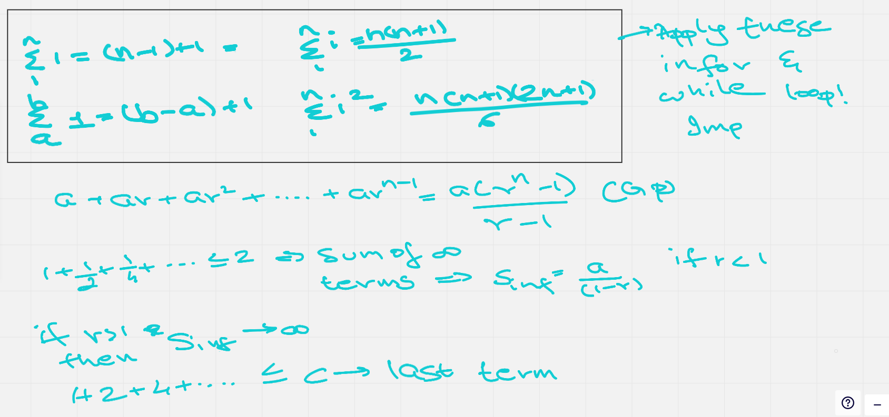

# Session 7

## Some math : 




## More about non-recursive algorithms 

also problems from the text book.

1) 
```c
S<-0
for i<- 1 to n do 
    S <- S+i*i
return S 
```
- computes sum of squares 
- Basic operation : multiplication 
- Basic operation done how many times : n 
- efficiency class : linear 
- Can this be made more efficient? : Yes, if known n we can apply formula directly

2)
```
minval<-A[0]; maxval<-A[0]
for i<- 1 to n-1 do 
    if A[i] < minval
        minval <- A[i]
    if A[i] > maxval
        maxval <- A[i]
return maxval-minval
```
- Computes : range of the values in the array
- Basic operation : comparision (2 times)
- Total number of basic operations : 2(n-1) : 2n-2
- Efficiency : linear
- Can this be mode efficient? : Yes, the 2nd if condition can be made else if

Can we do this algorithm by checking the pair of numbers?

So instead of 4 comparisions for 4 numbers, this will get it down to 3 comparisions for 4 numbers, implemenmt this.

3)
```
algo what(n)
    i <- 1
    while i <=n do
        <something>
        i<-i + 2
```
- Number of times the loop is executes : ceil(n/2) **IMPORTANT**
```
algo what(n)
    i <- 1
    while i<=n do
        <something>
        i<-i * 2
```
- Number of times the loop is executed : log(n,2) [base 2]
```
algo what(n)
    i <- 1 
    while i <= n do
        j <- n 
        while j >= 1 do 
            <something>
            j <- j/2
        i <- i + 1
```
- Number of times the loop is executed : nlog(n,2)
- Merge sort!

## Analysis of recursive algorithms

The process being : 
- Find input size 
- Find basic operation
- Check whether we have variation in # number of operations 
- express recurrence relationship
- solve it

Examples :

1)

```
algo fact(n)
    if n==0
        return 1
    else 
        return n*fact(n-1)
```
- Input size : n
- Basic operation : Multiplication
- Number of basic operations : 

```
M(0) : 0
M(n) : 1 + M(n-1)   => Bessels function, In discrete maths, this reps recursive.


M(n) = M(n-1) + 1
= M(n-2) + 2 
.
.
= M(n-i) + i   => ith step 
.
.
= M(n-n) + n   => nth step
= n + 1..thus complexity : theta(n)
```

2) 
```
algo what(n)
    if n == 1 then
        return 1
    else 
        return 1+what(n/2)
```
- what does this algo do?
    - numbers of "set" bits set in the given number 
- express recurrence : 
    - input size : n 
    - basic operation : addition 
    -  ```
        A(n) : 0 if n=1
             : 1 + A(n/2)
        ```
- solve it 
Note : try and get base case to finish the recurrence
```
A(n) = 1+A(n/2)
     = 2 + A(n/2^2)
     = 3 + A(n/2^3)
     .
     .
     = i + A(n/2^i)
assume 2^k =n 
     = k + A(n/2^k)   => Kth step 
     = k+A(1)
     = k 
     = log(n,2) : Complexity : log(n,2)
```
- write it iteratively 

```
ans <- 0
for i <- n to 0
    ans <- ans+ 1 
    i <- i/2
return ans
```
3)

- X(n) = X(n-1)+5
- n(1) = 0
```
X(n) = X(n-1)+5
     = X(n-2)+5*2 
     = X(n-3)+5*3
     ..
     = X(n-(n-1))+5*(n-1)
     = X(1)+5n+5
     = 5n+5     => Complexity : linear
```

4) 

- X(1) = 0
- X(n) = 2 * x(n/2) +n //merge sort :pepe_slam:
```
X(n) = 2 * X(n/2) +n 
     = 2 * [ 2*X(n/2^2) + n/2 ] + n 
     => 2^2 * X(n/2^2) + 2n
     => 2^3 * X(n/2^3) + 3n
     .. 2^k = n
     2^k * X(n/2^k) + kn
     2^k * X(1) + kn
     0+kn => log(n,2)n => complexity : n log n
```

5) 

- X(1) = 0
- X(n) = 2 * x(n/2) + 1
```
X(n) = 2 * X(n/2) +1
     = 2 * [ 2*X(n/2^2) + 1 ] + 1
     => 2^2 * X(n/2^2) + 2
     => 2^3 * X(n/2^3) + 3
     .. 2^k = n
     2^k * X(n/2^k) + k
     2^k * X(1) + k
     0+k => log(n,2) => complexity : log n
```

6) Tower of hanoi 
- f : from 
- t : through
- u : using 
```
algo move(n,f,t,u)
    if n == 0 then 
        return 
    else 
        // move n-1 from f to u using t 
        move(n-1,f,u,t)
        //move one disk from f to t 
        move_one_disk(f,t)
        // move n-1 from u to u using f
        move(n-1,u,t,f)
```
input size : n 
basic operation : move one disk 
diff case ? : 


Sir rage quite :/
