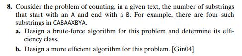

# Session 12 : Callbacks 

Basically pointer to a function.

- Write a function is_any : existential , a particular predicate holds true at least once and is_all 
- From text book, Start with A end with B substring:
  - 
  I believe I have written code for the b part and not a.
