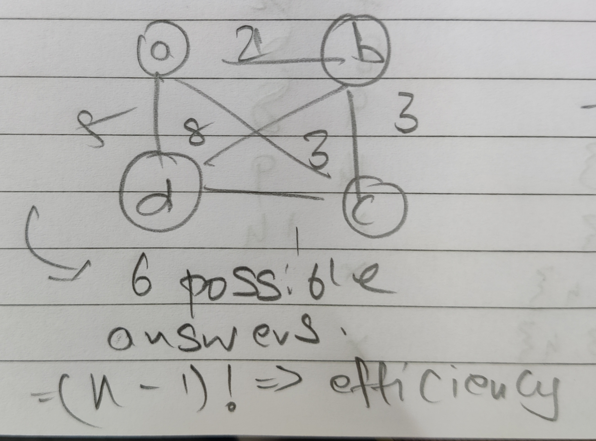

# Session-13 : Bruteforce - Exhaustive search 

In this session, we analyse few veryyyy important problem using exhaustive search. 

## N-Queens Problems : 
left as a assignment for the student 

## Travelling Salesman Problem (TSP) 

So before we can talk about TSP, lets look into other problems 

- Eluerain graph problem : Go to all edges 
  - This problem is solved/ The graph is Euluerian as long degree of all the nodes is even, remeber the one for entering and one for leaving.
- Hamiltonian graph : Go to all vertexes 
  - TSP is very similar to Hamiltonian, just that its an optimisation problem of Hamiltonian. One has to visit all cities using least possible weights 


So to solve this problem : 
- Data structure : A graph, ofc.
- 
- Solution : 
  - So we are gonna use exhaustive search here. In un-directed graph, the starting does not matter.
  - So we need to take permutations of all possible visits from a node, lemme consider A to be starting node :
  - ```
    A _ _ _ A => A 3*2*1 A => 6 
    to generalise to n => (n-1)!, if these were directed graphs then it out have been n!
    ```
- Thus, TSP can be solved using (n-1)! efficiency using bruteforce 

## Knapsack problem 

```
W = 10 => total weight the sack can carry 

objects : 
  1  2  3  4
w 7  3  4  5
v 42 12 40 25
```
- Optimise for max value.
- Data structure will be : 1D array
- Exahaustive search will be all possible subsets of the given weights, this would lead to 2^n sets. Thus Solving Knapsack problem with bruteforce will be of efficiency 2^n.

> Note : Most people in class were confused when he calculated even cases that can't fit into the sack, he does this cus the computer doesnt know if the given set is possible or not before computing. Thus exhaustive search calculates all posssible or not possible cases.

## Assignment problem : 

- A set of jobs and people who can solve them in variable time : 
- ```
      j1  j2  j3  j4
  p1  9   2   7   7
  p2  6   4   3   7
  p2  5   8   1   8
  p4  7   6   9   4
  ```
- Data structure : 2D array 
- So in theory your result should be like : (p1,j1),(p2,j3)...i.e 4 tuples of 2 members
- Problem being this increases the time efficiency a lot that bruteforce cant even be implmented
  - So a weird solution was done, the result is going to be just : p2 p3 p4 p1, where first index in the array of output does job 1, doing this quite weird fix gets our bruteforce into factorial time.
  - Some other problems that have weird fixes as such : FFT - multiplication of polynomials 
- Thus our solution : 
- ```
  _ _ _ _ => 4 * 3 * 2 * 1 => 24 
  in terms of n : n!
  ```
- To solve Assignment problems using bruteforce force, our efficiency will be n!.
