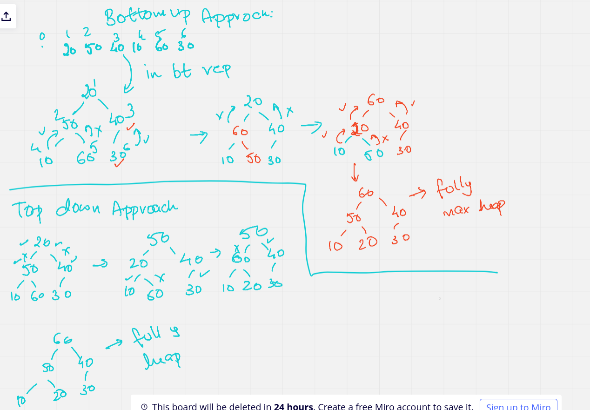
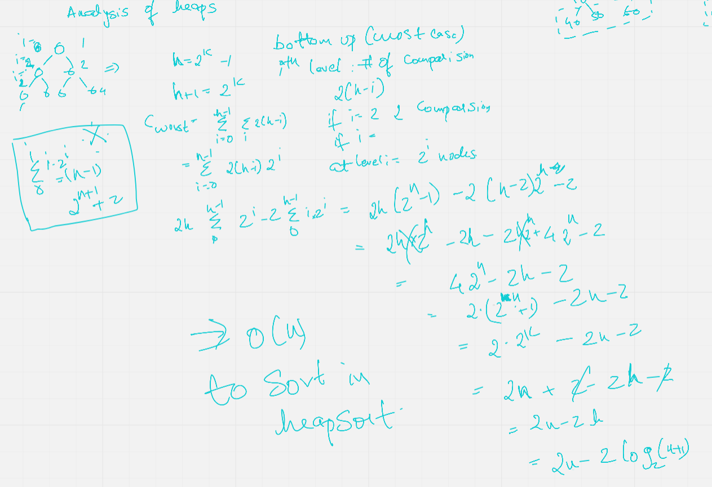

# Heaps 

- used for multiset : Similar to set, but can have non distinct elements (Not unique)

## Implementation for mutiset : 

- Hashing : 
- BST : possibly height balanced trees 
- Heap : To be disscussed 
hashing is good searching, but traversals are a big no 
BST not as efficient as hashing in searching, but very good for traversal 
but in heap : Search is bad, traversal is bad 
              but Finding max of min is very efficient in O(1)

But any of these can be used for implementation 

## Interfaces of multiset : 

- Membership = search 
- lower bound huh?
- upper bound huh?  
- equal range huh? 
- traverse

## Heaps the two 

So hardware heap and DS is the same? 

a) WRT to memory map or virtual address space 
    A program in state of execution is called a process 
    processes have virtual address space 
    A proc has : 
    - uarea : In unix filled by OS, things like fd (only the kernel knows the fs)
    - text segment : machine code (fixed in size, no modification)
    - data segment : global vars, static vars, string literals 
    - stack segment : automatic vars [grow and shrink in FIFO manner]
    - heap : Dynamic memory management [can also grow and shrink without any restrictions]

b) WRT to DS  

- Binary tree 
- Not a BST 
- Can have max/min heap (we only talk about max usuaully) : root has highest value
- Empty tree is a heap 
- Each node is the max of they child 
- Propertise : 
  - parental control : root of the tree have a value higher than that of child 
  - shape property : tree should be a complete tree? All levels except must be complete (like electron structure)


## Identify a heap 

 

## Representing a heap 
- Binary tree 
- array : 
  - each element of array :- index of left:key:index of right 
- arayy :
  - use 1 indexing, 
  - formula for finding left sub tree and right subtree
  - left(i) => 2*i 
  - right(i) => 2*i + 1
  - parent(i) => floor(i/2)
- Heap structure : 
  - store the size in 0th index 
- Structure hack : 
- ```
  struct what{
    // ...
    int a[1];
  }
  And if i need array of n elements: 
  struct what* p = malloc(sizeof(struct what)+(n-1)*sizeof(int))
  Doesn't make sense? good see the diagram below : 
  ```


This struct hack is veryyy cache frendly!! This can been seen in the programming examples
We have created a dynamic contiguous memory struct!!

Q1 : A complete binary tree of size n nodes is unique. What does this mean?
  Given a set of numbers, there is only one representation in BT
Q2 : How many leaves would a complete binary tree of n nodes have? 
  ciel(n/2)
Q3 : Can the 0th element of the heap be a sentinel?
Q4 : Implement heapify with lesser swaps

## how to create a heap 

20 50 40 10 60 30 
bottom up:  
  All leaves are heaps 
  Heapify from the node n/2 - do that till root 


Bottom up is more efficient than top down? We will see this in mathematical analysis

## heapsort : 
get a full heap :
```
repeat this n-1 times
  exchange the first element with last 
  decrease the size 
  heapify along the first element 
``` 
Q5 : Why is this not used in libraries? It's not cache frendly

## Analysis of heapsort 


  
